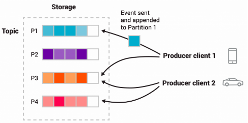
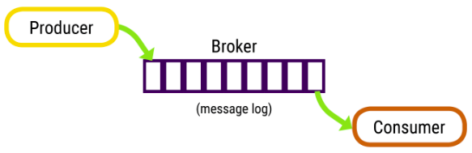
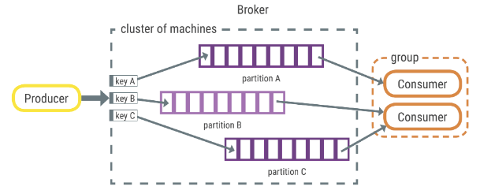

# 1.1 Introdução

## O que é streaming de eventos?

Tecnicamente falando, o streaming de eventos é a prática de capturar dados em tempo real de fontes de eventos como bancos de dados, sensores, dispositivos móveis, serviços em nuvem e aplicativos de software na forma de fluxos de eventos; armazenar esses fluxos de eventos de forma duradoura para recuperação posterior; manipular, processar e reagir aos fluxos de eventos em tempo real e também retrospectivamente; e encaminhar os fluxos de eventos para diferentes tecnologias de destino, conforme necessário. O streaming de eventos, portanto, garante um fluxo contínuo e interpretação dos dados para que as informações certas estejam no lugar certo, na hora certa.

## Para que usar o streaming de eventos?

O streaming de eventos é aplicado a uma [ampla variedade de casos de uso](https://kafka.apache.org/powered-by) em uma infinidade de setores e organizações. Seus muitos exemplos incluem:

* Para processar pagamentos e transações financeiras em tempo real, como em bolsas de valores, bancos e seguros.
* Rastrear e monitorar carros, caminhões, frotas e remessas em tempo real, como na logística e na indústria automotiva.
* Para capturar e analisar continuamente os dados do sensor de dispositivos IoT (Internet das Coisas) ou outros equipamentos, como fábricas e parques eólicos.
* Para coletar e reagir imediatamente às interações e pedidos do cliente, como no varejo, no setor de hotéis e viagens e em aplicativos móveis.
* Para monitorar pacientes em cuidados hospitalares e prever mudanças nas condições para garantir o tratamento oportuno em emergências.
* Conectar, armazenar e disponibilizar dados produzidos por diferentes divisões de uma empresa.
* Para servir como base para plataformas de dados, arquiteturas orientadas a eventos e microsserviços.

## Apache Kafka® é uma plataforma de streaming de eventos. O que isso significa?

O Kafka combina três recursos principais para que você possa implementar seus casos de uso para streaming de eventos de ponta a ponta com uma única solução testada em batalha:

1. Para **publicar (publish)** (gravar) e **assinar (subscribe)** (ler) fluxos de eventos, incluindo importação/exportação contínua de seus dados de outros sistemas.
2. Para **armazenar (store)** fluxos de eventos de forma durável e confiável pelo tempo que você quiser.
3. Para **processar (process)** fluxos de eventos conforme eles ocorrem ou retrospectivamente.

E toda essa funcionalidade é fornecida de maneira distribuída, altamente escalável, elástica, tolerante a falhas e segura. O Kafka pode ser implantado em hardware bare-metal, máquinas virtuais e contêineres, e no local, bem como na nuvem. Você pode escolher entre o autogerenciamento de seus ambientes Kafka e o uso de serviços totalmente gerenciados oferecidos por uma variedade de fornecedores.

## Como funciona o Kafka em poucas palavras?

Kafka é um sistema distribuído que consiste em **servidores(servers)** e **clientes(clients)** que se comunicam por meio de um [protocolo de rede TCP](https://kafka.apache.org/protocol.html) de alto desempenho. Ele pode ser implantado em hardware bare-metal, máquinas virtuais e contêineres no local, bem como em ambientes de nuvem.

**Servidores (Servers)** : o Kafka é executado como um cluster de um ou mais servidores que podem abranger vários datacenters ou regiões de nuvem. Alguns desses servidores formam a camada de armazenamento, chamados de brokers. Outros servidores executam o Kafka Connect para importar e exportar dados continuamente como fluxos de eventos para integrar o Kafka com seus sistemas existentes, como bancos de dados relacionais, bem como outros clusters Kafka. Para permitir que você implemente casos de uso de missão crítica, um cluster Kafka é altamente escalonável e tolerante a falhas: se algum de seus servidores falhar, os outros servidores assumirão seu trabalho para garantir operações contínuas sem nenhuma perda de dados.

**Clientes (Clients)** : eles permitem que você escreva aplicativos e microsserviços distribuídos que leem, gravam e processam fluxos de eventos em paralelo, em escala e de maneira tolerante a falhas, mesmo no caso de problemas de rede ou falhas de máquina. O Kafka vem com alguns desses clientes incluídos, que são aumentados por [dezenas de clientes](https://cwiki.apache.org/confluence/display/KAFKA/Clients) fornecidos pela comunidade Kafka: os clientes estão disponíveis para Java e Scala, incluindo a biblioteca Kafka Streams de nível superior, para Go, Python, C/C++ e muitas outras programações linguagens, bem como APIs REST.

## Principais conceitos e terminologia

Um **evento** registra o fato de que "algo aconteceu" no mundo ou no seu negócio. Também é chamado de registro ou mensagem na documentação. Ao ler ou gravar dados no Kafka, você o faz na forma de eventos. Conceitualmente, um evento possui uma chave, um valor, um carimbo de data/hora e cabeçalhos de metadados opcionais. Aqui está um exemplo de evento:

* **Chave do evento (Event key)**: "Alice"
* **Valor do evento (Event value)**: "Efetuou um pagamento de R$200 para Bob"
* **Data e hora do evento (Event timestamp)**: "25 de junho de 2020 às 14h06"

Os **produtores (Producers)** são os aplicativos clientes que **publicam (publish)** (gravam) eventos no Kafka e os **consumidores (consumers)** são os que assinam (lêem e processam) esses eventos. Em Kafka, produtores e consumidores são totalmente dissociados e agnósticos entre si, o que é um elemento chave de design para alcançar a alta escalabilidade pela qual Kafka é conhecida. Por exemplo, os produtores nunca precisam esperar pelos consumidores. O Kafka oferece várias garantias, como a capacidade de processar eventos exatamente uma vez.

Os **eventos (Events)** são organizados e armazenados de forma duradoura em **tópicos (topics)**. Muito simplificado, um tópico é semelhante a uma pasta em um sistema de arquivos, e os eventos são os arquivos dessa pasta. Um exemplo de nome de tópico poderia ser "pagamentos". Os **tópicos** no Kafka são sempre multiprodutor e multi-assinante: um tópico pode ter zero, um ou muitos produtores que gravam eventos nele, bem como zero, um ou muitos consumidores que assinam esses eventos. Os eventos em um tópico podem ser lidos com a frequência necessária - ao contrário dos sistemas de mensagens tradicionais, os eventos não são excluídos após o consumo. Em vez disso, você define por quanto tempo o Kafka deve reter seus eventos por meio de uma definição de configuração por tópico, após o qual os eventos antigos serão descartados. O desempenho do Kafka é efetivamente constante com relação ao tamanho dos dados, portanto, armazenar dados por um longo tempo é perfeitamente adequado.

Os **tópicos** são **particionados (partitioned)**, o que significa que um tópico é espalhado por vários **"depósitos (buckets)"** localizados em diferentes brokers Kafka. Esse posicionamento distribuído de seus dados é muito importante para a escalabilidade, pois permite que os aplicativos clientes leiam e gravem os dados de/para em vários brokers ao mesmo tempo. Quando um novo evento é publicado em um tópico, ele na verdade é anexado a uma das partições do tópico. Eventos com a mesma chave de evento (por exemplo, um cliente ou ID de veículo) são gravados na mesma partição, e o Kafka garante que qualquer consumidor de uma determinada partição de tópico sempre lerá os eventos dessa partição exatamente na mesma ordem em que foram gravados.

  
  

    Figura: Este tópico de exemplo tem quatro partições P1–P4. Dois clientes producers diferentes estão publicando, independentemente um do outro, novos eventos no tópico, gravando eventos na rede nas partições do tópico. Eventos com a mesma chave (denotados por suas cores na figura) são gravados na mesma partição. Observe que ambos os produtores (producers) podem gravar na mesma partição (partition), se apropriado.
  

Para tornar seus dados tolerantes a falhas e altamente disponíveis, todos os tópicos podem ser **replicados (replicated)**, mesmo em regiões geográficas ou datacenters diferentes, de modo que sempre haja vários brokers com uma cópia dos dados para caso algo dê errado, você deseja fazer manutenção nos brokers e assim por diante. Uma configuração de produção comum é um fator de replicação de 3, ou seja, sempre haverá três cópias de seus dados. Essa replicação é realizada no nível das partições de tópico.

Este primer deve ser suficiente para uma introdução. A seção [Design](https://kafka.apache.org/documentation/#design) da documentação explica os vários conceitos de Kafka em detalhes completos, se você estiver interessado.

os vários conceitos de Kafka em detalhes completos, se você estiver interessado.

## APIs Kafka

Além das ferramentas de linha de comando para tarefas de gerenciamento e administração, o Kafka tem cinco APIs principais para Java e Scala:

* A API Admin (Admin API) para gerenciar e inspecionar tópicos, brokers e outros objetos Kafka.
* A API do Produtor (Producer API) para publicar (publish) (gravar) um fluxo de eventos para um ou mais tópicos do Kafka.
* A API do consumidor para assinar (subscribe) (ler) um ou mais tópicos e processar o fluxo de eventos produzidos para eles.
* A API Kafka Streams para implementar aplicativos de processamento de fluxo e microsserviços. Ele fornece funções de nível superior para processar fluxos de eventos, incluindo transformações, operações com estado como agregações e junções, janelas, processamento com base no horário do evento e muito mais. A entrada é lida de um ou mais tópicos a fim de gerar saída para um ou mais tópicos, transformando efetivamente os fluxos de entrada em fluxos de saída.
* A API do Kafka Connect para construir e executar conectores de importação/exportação de dados reutilizáveis ​​que consomem (lêem) ou produzem (gravam) fluxos de eventos de e para sistemas e aplicativos externos, para que possam se integrar ao Kafka. Por exemplo, um conector para um banco de dados relacional como PostgreSQL pode capturar todas as alterações em um conjunto de tabelas. No entanto, na prática, você normalmente não precisa implementar seus próprios conectores porque a comunidade Kafka já fornece centenas de conectores prontos para uso.

# 1.2 Casos de Uso

Aqui está uma descrição de alguns dos casos de uso populares do Apache Kafka®. Para obter uma visão geral de várias dessas áreas em ação, consulte [esta postagem do blog](https://engineering.linkedin.com/distributed-systems/log-what-every-software-engineer-should-know-about-real-time-datas-unifying).

## Mensagens (Messaging)

O Kafka funciona bem como um substituto para um broker de mensagens mais tradicional. Os intermediários de mensagens são usados ​​por vários motivos (para desacoplar o processamento dos data producers, para armazenar mensagens não processadas em buffer, etc.). Em comparação com a maioria dos sistemas de mensagens, o Kafka tem melhor rendimento, particionamento integrado, replicação e tolerância a falhas, o que o torna uma boa solução para aplicativos de processamento de mensagens em grande escala.
Em nossa experiência, os usos de mensagens costumam ter um rendimento relativamente baixo, mas podem exigir uma latência ponta a ponta baixa e muitas vezes dependem das fortes garantias de durabilidade que o Kafka oferece.

Nesse domínio, o Kafka é comparável aos sistemas de mensagens tradicionais, como ActiveMQ ou RabbitMQ .

## Rastreamento de atividade do site (Website Activity Tracking)

O caso de uso original para Kafka era ser capaz de reconstruir um pipeline de rastreamento de atividades do usuário como um conjunto de feeds de publicação-assinatura em tempo real. Isso significa que a atividade do site (visualizações de página, pesquisas ou outras ações que os usuários podem realizar) é publicada em tópicos centrais com um tópico por tipo de atividade. Esses feeds estão disponíveis para assinatura para uma variedade de casos de uso, incluindo processamento em tempo real, monitoramento em tempo real e carregamento em Hadoop ou sistemas de armazenamento de dados offline para processamento offline e relatórios.
O rastreamento de atividades costuma ter um volume muito alto, pois muitas mensagens de atividades são geradas para cada visualização de página do usuário.

# Métricas (Metrics)

Kafka é frequentemente usado para dados de monitoramento operacional. Isso envolve a agregação de estatísticas de aplicativos distribuídos para produzir feeds centralizados de dados operacionais.

# Agregação de Log (Log Aggregation)

Muitas pessoas usam o Kafka como um substituto para uma solução de agregação de log. A agregação de log normalmente coleta arquivos de log físicos de servidores e os coloca em um local central (um servidor de arquivos ou HDFS-Hadoop Distributed File System ) para processamento. O Kafka abstrai os detalhes dos arquivos e oferece uma abstração mais clara dos dados de log ou eventos como um fluxo de mensagens. Isso permite processamento de baixa latência e suporte mais fácil para várias fontes de dados e consumo de dados distribuídos. Em comparação com sistemas centrados em log, como Scribe ou Flume, o Kafka oferece desempenho igualmente bom, garantias de durabilidade mais fortes devido à replicação e latência de ponta a ponta muito menor.

# Processamento de fluxo (Stream Processing)

Muitos usuários do Kafka processam dados em pipelines de processamento que consistem em vários estágios, onde os dados de entrada brutas são consumidos de tópicos Kafka e então agregados, enriquecidos ou de outra forma transformados em novos tópicos para consumo posterior ou processamento de acompanhamento. Por exemplo, um pipeline de processamento para recomendar artigos de notícias pode rastrear o conteúdo do artigo de feeds RSS e publicá-lo em um tópico de "artigos"; o processamento posterior pode normalizar ou desduplicar esse conteúdo e publicar o conteúdo do artigo limpo em um novo tópico; um estágio final de processamento pode tentar recomendar esse conteúdo aos usuários. Esses pipelines de processamento criam gráficos de fluxos de dados em tempo real com base nos tópicos individuais. A partir de 0.10.0.0, uma biblioteca de processamento de stream leve, mas poderosa, chamada Kafka Streams está disponível no Apache Kafka para realizar o processamento de dados conforme descrito acima. Além do Kafka Streams, ferramentas alternativas de processamento de stream de código aberto incluem Apache Storm e Apache Samza .

# Sourcing de eventos (Event Sourcing)

A fonte de eventos é um estilo de design de aplicativo em que as mudanças de estado são registradas como uma sequência de registros ordenada por tempo. O suporte de Kafka para dados de log armazenados muito grandes o torna um excelente back-end para um aplicativo construído neste estilo.

# Commit Log

O Kafka pode servir como uma espécie de log de confirmação externo para um sistema distribuído. O log ajuda a replicar dados entre os nós e atua como um mecanismo de ressincronização para que os nós com falha restaurem seus dados. O recurso de [compactação de log](https://kafka.apache.org/documentation.html#compaction) no Kafka ajuda a suportar esse uso. Nesse uso, o Kafka é semelhante ao projeto [Apache BookKeeper](https://bookkeeper.apache.org/) .

# Como as mensagens do Apache Kafka são escritas

Apache Kafka ™ é uma fila de mensagens de streaming distribuída. Os produtores publicam mensagens em um tópico, o broker as armazena na ordem recebida e os consumidores assinam e leem mensagens do tópico.

  

Mensagens (registros) são armazenados como bytes serializados; os consumidores são responsáveis ​​por desserializar a mensagem. As mensagens podem ter qualquer formato, os mais comuns são string, JSON e Avro.

As mensagens sempre têm uma estrutura de chave-valor; uma chave ou valor pode ser nulo. Se o produtor não indicar onde gravar os dados, o broker usará a chave para particionar e replicar mensagens. Quando a chave é nula, as mensagens são distribuídas usando a distribuição round-robin.

  

As partições de tópico contêm um conjunto ordenado de mensagens e cada mensagem na partição possui um deslocamento exclusivo. O Kafka não rastreia quais mensagens foram lidas por uma tarefa ou consumidor. Os consumidores devem rastrear sua própria localização em cada registro.