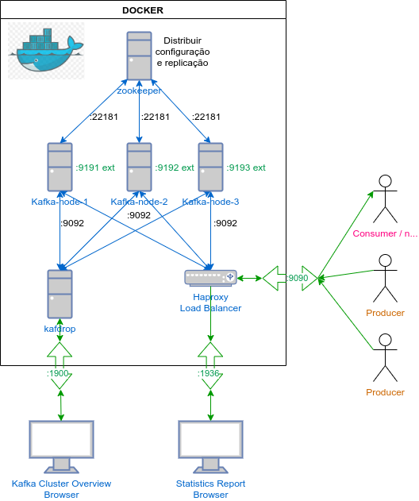
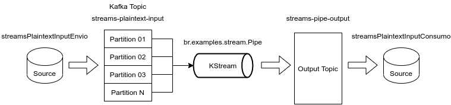
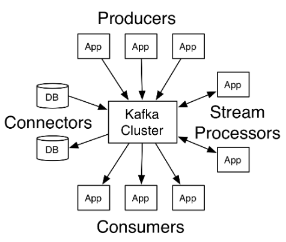
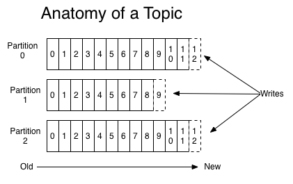
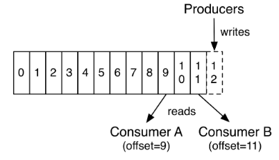
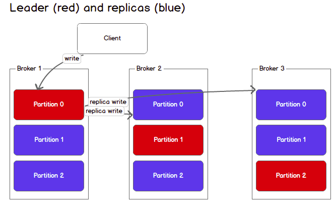
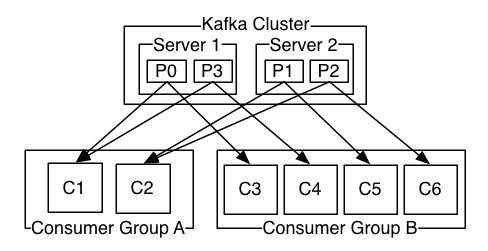

[](https://www.codefactor.io/repository/github/danielso2007/zookeeper_kafka_kafdrop)


# Zookeeper kafka kafdrop

Projeto de estudo do Kafka com docker. Uma documentação básica ver : [DOC.md](DOC.md).

O projeto inicia com um (1) zookeeper para fazer serviço centralizado para manter informações de configuração entre os nós kafka criados pelo docker-compose. Serão criados 3 nós kafka distribuídos onde os tópicos são replicados entre eles, sendo um (1) líder (controller) recebendo as informações e os outros recebendo a replicação. Caso o nó principal caia, outro assumirar o controller e se tornará o líder.

Para esse projeto, usamos o Kafdrop para interface web de visualização e criação de tópicos. Ao iniciar o docker, acessar o endereço: [http://localhost:1900/](http://localhost:1900/).

Como teste e balanceamento de cargas, foi criado um container usando o proxy para balancear o acesso entre os nós kafka. O objetivo é manter apenas um (1) endereço e uma (1) porta de acesso dos projetos. Assim, ao configurar o projeto java para acessar o kafka, apenas um endereço e porta serão necessários informar, sendo responsabilidade do proxy balancear o acesso entre os nós kafka. Para acessar o haproxy (login: haproxy e password: haproxy): [http://localhost:1936/](http://localhost:1936/).

<p align="center">
  
</p>

## Cliente de desktop Apache Kafka

GUI sobre o ecossistema Kafka, para tornar o desenvolvimento e o gerenciamento de clusters Apache Kafka o mais fácil possível. Recomendo usar o [conduktor.io](https://www.conduktor.io/) para o gerenciamento e monitoramento dos tópicos e grupos criados nos kafkas.
## Documentação e exemplos

* [Apache Kafka](https://kafka.apache.org/)
  * Apache Kafka é uma plataforma de streaming de eventos distribuídos de código aberto usada por milhares de empresas para pipelines de dados de alto desempenho, análise de streaming, integração de dados e aplicativos de missão crítica.
* [Apache Kafka Desktop Client](https://www.conduktor.io/)
  * GUI sobre o ecossistema Kafka, para tornar o desenvolvimento e o gerenciamento de clusters Apache Kafka o mais fácil possível.
* [Kafdrop – Kafka Web UI](https://github.com/obsidiandynamics/kafdrop)
  * Kafdrop é uma IU da web para visualizar os tópicos do Kafka e navegar pelos grupos de consumidores. A ferramenta exibe informações como brokers, tópicos, partições, consumidores e permite que você visualize mensagens.
* [kafka-stack-docker-compose](https://github.com/simplesteph/kafka-stack-docker-compose)
  * Exemplo de criação de docker-compose de imagens kafka.
* [Apache ZooKeeper](https://zookeeper.apache.org/)
  * O ZooKeeper é um serviço centralizado para manter informações de configuração, nomenclatura, fornecer sincronização distribuída e fornecer serviços de grupo. 

## Iniciando o container Docker

Para iniciar o projeto, execute os comandos abaixo:

* ```./iniciar.sh``` - Ao iniciar o projeto, o script verifica se a imagem haproxy foi criado, caso negativo, a imagem será criada na primeira chamada. A segunda ação do script será criar a pasta ```data``` contendo o volume de cada container criado, modificando a permissão para permitir acesso e modificação. E no final, é iniciado os container usando o docker-compose.

* ```./stop.sh``` - Para todos os container.

* ```./remove.sh``` - Para e remover todos os containers docker e seus volumes.

## Executando exemplo 01 java

Para exemplos java, entrar na pasta `java`. Inicialmente, criar o tópico no endereço [localhost:1900/](http://localhost:1900/) com os dados abaixo:
* Clicar em ```+ New```;
* **Topic name**: teste_java
* **Number of partitions**: 15
* **Replication factor**: 3

Para compilar o projeto, execute o script ```./clean```. Podem ser executados quandos serviços você quiser, desde que não sejam repetidos as portas. O mesmo para os consumidores.

### Envio (java/envioKafka):

* Envio 1:

```mvn spring-boot:run -Dspring-boot.run.arguments=--server.port=8801```

* Envio 2:

```mvn spring-boot:run -Dspring-boot.run.arguments=--server.port=8802```

### Consumo (java/consumoKafka):

```mvn spring-boot:run -Dspring-boot.run.arguments=--server.port=9901```

## Executando exemplo 02 java

Esse exemplo consiste no envio de um objeto java serializado e o consumo desserializando o objeto java.

### Envio (java/venda-ingressos):

```mvn spring-boot:run -Dspring-boot.run.arguments=--server.port=8001```

### Consumo (java/processamento-vendas):

```mvn spring-boot:run -Dspring-boot.run.arguments=--server.port=9001```

## WRITE A KAFKA STREAMS APPLICATION

Kafka Streams é uma biblioteca cliente para processamento e análise de dados armazenados no Kafka. Ele se baseia em conceitos importantes de processamento de fluxo, como distinção adequada entre tempo de evento e tempo de processamento, suporte a janelas e gerenciamento simples, mas eficiente, e consulta em tempo real do estado do aplicativo.

O Kafka Streams tem uma barreira baixa de entrada : você pode escrever e executar rapidamente uma prova de conceito em pequena escala em uma única máquina; e você só precisa executar instâncias adicionais de seu aplicativo em várias máquinas para escalar para cargas de trabalho de produção de alto volume. O Kafka Streams lida de forma transparente com o balanceamento de carga de várias instâncias do mesmo aplicativo, aproveitando o modelo de paralelismo de Kafka.

### Topologia de processamento de fluxo

* Um fluxo é a abstração mais importante fornecida pelo Kafka Streams: ele representa um conjunto de dados ilimitado e continuamente atualizado. Um fluxo é uma sequência ordenada, reproduzível e tolerante a falhas de registros de dados imutáveis, em que um registro de dados é definido como um par de valor-chave.
* Um aplicativo de processamento de fluxo é qualquer programa que faz uso da biblioteca Kafka Streams. Ele define sua lógica computacional por meio de uma ou mais topologias de processador , onde uma topologia de processador é um gráfico de processadores de fluxo (nós) que são conectados por fluxos (bordas).
* Um processador de fluxo é um nó na topologia do processador; ele representa uma etapa de processamento para transformar dados em fluxos recebendo um registro de entrada por vez de seus processadores upstream na topologia, aplicando sua operação a ele e pode, subsequentemente, produzir um ou mais registros de saída para seus processadores downstream.

Existem dois processadores especiais na topologia:

* Processador de origem : um processador de origem é um tipo especial de processador de fluxo que não possui nenhum processador upstream. Ele produz um fluxo de entrada para sua topologia a partir de um ou vários tópicos do Kafka, consumindo registros desses tópicos e os encaminhando para seus processadores down-stream.
* Processador dissipador : um processador dissipador é um tipo especial de processador de fluxo que não possui processadores down-stream. Ele envia todos os registros recebidos de seus processadores up-stream para um tópico Kafka especificado.

### Aplicativo Streams: Pipe

Nesse aplicativo criamos uma topology ```final StreamsBuilder builder = new StreamsBuilder();``` e criamos um fluxo de origem a partir de um tópico Kafka denominado ```streams-plaintext-input```. É necessário criar anteriormente no seu kafka o tópico ```streams-plaintext-input```. O objetivo do aplicativo Pipe é escreve todos os registros do tópico ```streams-plaintext-input``` em outro tópico chamado: ```streams-pipe-output```. Para mais detalher, [ver aqui](https://kafka.apache.org/27/documentation/streams/tutorial#tutorial_code_pipe).

<p align="center">
  
</p>

Para executar o aplicativo: ```mvn exec:java -Dexec.mainClass=br.examples.stream.Pipe```

### Aplicativo Streams: Line Split

Como cada registro do stream de origem é um String par de `chave-valore` digitados, vamos tratar a string de `valor` como uma linha de texto e dividi-la em palavras com um `FlatMapValuesoperador`. O operador tomará o fluxo fonte (source) como sua entrada e gerará um novo fluxo nomeado `words` processando cada registro de seu fluxo de origem em ordem e quebrando sua string de `valor` em uma lista de palavras e produzindo cada palavra como um novo registro para o fluxo words de saída. Este é um operador sem estado que não precisa rastrear nenhum registro recebido anteriormente ou resultados processados. E, finalmente, podemos escrever a palavra fluxo de volta em outro tópico Kafka, digamos `streams-linesplit-output`.

<p align="center">
  
</p>

Para executar o aplicativo: ```mvn exec:java -Dexec.mainClass=br.examples.stream.LineSplit```

### Aplicativo Streams: Wordcount

Adicionar alguns cálculos "stateful" à topologia, contando a ocorrência das palavras divididas do fluxo de texto de origem. Para fazer a agregação de contagem, temos primeiro de especificar que queremos codificar o fluxo na string de valor, ou seja, a palavra em caixa baixa, com um groupByoperador. Este operador gera um novo fluxo agrupado, que pode então ser agregado por um countoperador, que gera uma contagem em execução em cada uma das chaves agrupadas. Observe que o countoperador tem um `Materialized` parâmetro que especifica que a contagem em execução deve ser armazenada em um armazenamento de estado denominado `counts-store`.
Também podemos escrever o countsfluxo do changelog do KTable de volta em outro tópico do Kafka, digamos `streams-wordcount-output`. Como o resultado é um fluxo de log de mudanças, o tópico de saída `streams-wordcount-output` deve ser configurado com compactação de log habilitada. Observe que desta vez o tipo de valor não é mais `String` mas `Long`, portanto, as classes de serialização padrão não são mais viáveis ​​para gravá-lo no Kafka. Precisamos fornecer métodos de serialização substituídos para `Long` tipos, caso contrário, uma exceção de tempo de execução será lançada. Observe que, para ler o fluxo do log de alterações do tópico `streams-wordcount-output`, é necessário definir a desserialização do valor como `org.apache.kafka.common.serialization.LongDeserializer`.

Para executar o aplicativo: ```mvn exec:java -Dexec.mainClass=br.examples.stream.WordCount```

# Apache Kafka® é uma plataforma de streaming distribuída. O que exatamente isso significa?

Uma plataforma de streaming possui três recursos principais:

* Publique e assine fluxos de registros, semelhante a uma fila de mensagens ou sistema de mensagens corporativo.
* Armazene fluxos de registros de maneira durável e tolerante a falhas.
* Processar fluxos de registros à medida que ocorrem.

Kafka é geralmente usado para duas grandes classes de aplicações:

* Criação de pipelines de dados de streaming em tempo real que obtêm dados entre sistemas ou aplicativos de maneira confiável.
* Criação de aplicativos de streaming em tempo real que transformam ou reagem aos fluxos de dados.

Para entender como Kafka faz essas coisas, vamos mergulhar e explorar as capacidades de Kafka de baixo para cima.

Primeiro alguns conceitos:

* O Kafka é executado como um cluster em um ou mais servidores que podem abranger vários datacenters.
* O cluster Kafka armazena fluxos de registros em categorias chamadas tópicos (topics).
* Cada registro consiste em uma chave, um valor e um carimbo de data/hora (timestamp).

Kafka tem quatro APIs principais:

* A Producer API permite que um aplicativo publique um fluxo de registros para um ou mais tópicos do Kafka.
* A Consumer API permite que um aplicativo assine (subscribe) um ou mais tópicos (topics) e processe o fluxo de registros produzidos para eles.
* A Streams API permite que um aplicativo atue como um processador de fluxo, consumindo um fluxo de entrada de um ou mais tópicos (topics) e produzindo um fluxo de saída para um ou mais tópicos (topics) de saída, transformando efetivamente os fluxos de entrada em fluxos de saída.
* O Connector API permite construir e executar produtores (producers) ou consumidores (consumers) reutilizáveis ​​que conectam tópicos do Kafka a aplicativos ou sistemas de dados existentes. Por exemplo, um conector para um banco de dados relacional pode capturar todas as alterações em uma tabela.

<p align="center">
  
</p>

No Kafka, a comunicação entre os clientes (clients) e os servidores (servers) é feita com um protocolo TCP simples, de alto desempenho e independente de linguagem. Este protocolo é versionado e mantém a compatibilidade com versões anteriores.

## Tópicos e registros

Vamos primeiro mergulhar na abstração central que Kafka fornece para um fluxo de registros - o topic.

Um tópico é uma categoria ou nome de feed para o qual os registros são publicados. Os tópicos no Kafka são sempre com vários assinantes; ou seja, um tópico pode ter zero, um ou muitos consumidores que assinam os dados gravados nele.

Para cada tópico, o cluster Kafka mantém um registro particionado semelhante a este:

<p align="center">
  
</p>


Cada partição é uma sequência ordenada e imutável de registros que é continuamente anexada a um log de confirmação estruturado. Cada um dos registros nas partições é atribuído a um número de identificação sequencial, denominado deslocamento, que identifica exclusivamente cada registro na partição.

O cluster Kafka persiste de forma durável todos os registros publicados - tenham ou não sido consumidos - usando um período de retenção configurável. Por exemplo, se a política de retenção for definida para dois dias, nos dois dias após a publicação de um registro, ele estará disponível para consumo, após o qual será descartado para liberar espaço. O desempenho do Kafka é efetivamente constante com relação ao tamanho dos dados, portanto, armazenar dados por um longo tempo não é um problema.

<p align="center">
  
</p>

Na verdade, os únicos metadados retidos por consumidor são o deslocamento ou a posição desse consumidor no log. Esse deslocamento é controlado pelo consumidor: normalmente um consumidor avançará seu deslocamento linearmente à medida que lê os registros, mas, na verdade, como a posição é controlada pelo consumidor, ele pode consumir os registros na ordem que desejar. Por exemplo, um consumidor pode redefinir para um deslocamento mais antigo para reprocessar dados do passado ou pular para o registro mais recente e começar a consumir a partir de "agora".

Essa combinação de recursos significa que os consumidores Kafka são muito baratos - eles podem entrar e sair sem muito impacto no cluster ou em outros consumidores. Por exemplo, você pode usar nossas ferramentas de linha de comando para "limitar" o conteúdo de qualquer tópico sem alterar o que é consumido por qualquer consumidor existente.

As partições no log têm vários propósitos. Primeiro, eles permitem que o log seja dimensionado além de um tamanho que caiba em um único servidor. Cada partição individual deve caber nos servidores que a hospedam, mas um tópico pode ter muitas partições para que possa lidar com uma quantidade arbitrária de dados. Em segundo lugar, eles agem como a unidade de paralelismo.

## Distribuição

As partições do log são distribuídas pelos servidores no cluster Kafka, com cada servidor tratando de dados e solicitações de compartilhamento das partições. Cada partição é replicada em um número configurável de servidores para tolerância a falhas.

Cada partição possui um servidor que atua como "líder" e zero ou mais servidores que atuam como "seguidores". O líder lida com todas as solicitações de leitura e gravação para a partição enquanto os seguidores replicam passivamente o líder. Se o líder falhar, um dos seguidores se tornará automaticamente o novo líder. Cada servidor atua como um líder para algumas de suas partições e um seguidor para outras, de forma que a carga seja bem balanceada dentro do cluster.

<p align="center">
  
</p>

## Georreplicação

Kafka MirrorMaker fornece suporte de replicação geográfica para seus clusters. Com o MirrorMaker, as mensagens são replicadas em vários datacenters ou regiões de nuvem. Você pode usar isso em cenários ativos / passivos para backup e recuperação; ou em cenários ativos/ativos para colocar os dados mais perto de seus usuários ou para oferecer suporte aos requisitos de localidade dos dados.

## Produtores (Producers)
Os produtores publicam dados nos tópicos de sua escolha. O produtor é responsável por escolher qual registro designar a qual partição dentro do tópico. Isso pode ser feito em rodízio simplesmente para balancear a carga ou pode ser feito de acordo com alguma função de partição semântica (digamos, com base em alguma chave no registro). Mais sobre o uso de particionamento em um segundo!

## Consumidores (Consumers)

Os consumidores se rotulam com um nome de grupo de consumidores e cada registro publicado em um tópico é entregue a uma instância de consumidor em cada grupo de consumidores assinantes. As instâncias do consumidor podem estar em processos separados ou em máquinas separadas.

Se todas as instâncias do consumidor tiverem o mesmo grupo de consumidores, a carga dos registros será efetivamente balanceada nas instâncias do consumidor.

Se todas as instâncias do consumidor tiverem grupos de consumidores diferentes, cada registro será transmitido para todos os processos do consumidor.

<p align="center">
  
</p>

Um cluster Kafka de dois servidores que hospeda quatro partições (P0-P3) com dois grupos de consumidores. O grupo de consumidores **A** tem duas instâncias de consumidor e o grupo **B** tem quatro.

Mais comumente, porém, descobrimos que os tópicos têm um pequeno número de grupos de consumidores, um para cada "assinante lógico". Cada grupo é composto de várias instâncias do consumidor para escalabilidade e tolerância a falhas. Isso nada mais é do que uma semântica publicar-assinar (publish-subscribe), em que o assinante é um cluster de consumidores em vez de um único processo.

A maneira como o consumo é implementado no Kafka é dividindo as partições no log sobre as instâncias do consumidor, de modo que cada instância seja o consumidor exclusivo de uma "parte justa" das partições a qualquer momento. Esse processo de manutenção da associação ao grupo é gerenciado pelo protocolo Kafka dinamicamente. Se novas instâncias ingressarem no grupo, elas assumirão algumas partições de outros membros do grupo; se uma instância morrer, suas partições serão distribuídas para as instâncias restantes.

O Kafka fornece apenas uma ordem total sobre os registros em uma partição, não entre diferentes partições em um tópico. A ordenação por partição combinada com a capacidade de particionar dados por chave é suficiente para a maioria dos aplicativos. No entanto, se você precisar de um pedido total sobre os registros, isso pode ser obtido com um tópico que tem apenas uma partição, embora isso signifique apenas um processo de consumidor por grupo de consumidores.

## Multi-tenancy (Múltiplos inquilinos)

Você pode implantar o Kafka como uma solução multilocatário. A multilocação é ativada pela configuração de quais tópicos podem produzir ou consumir dados. Também há suporte para operações de cotas. Os administradores podem definir e impor cotas em solicitações para controlar os recursos do broker que são usados ​​pelos clientes. Para obter mais informações, consulte a [documentação de segurança](https://kafka.apache.org/documentation/#security).

## Garantias

Em um alto nível, Kafka oferece as seguintes garantias:

* As mensagens enviadas por um produtor para uma partição de tópico específica serão anexadas na ordem em que são enviadas. Ou seja, se um registro **M1** é enviado pelo mesmo produtor que um registro **M2**, e **M1** é enviado primeiro, **M1** terá um deslocamento inferior a **M2** e aparecerá antes no log.
* Uma instância do consumidor vê os registros na ordem em que são armazenados no log.
* Para um tópico com fator de replicação N, toleraremos até N-1 falhas de servidor sem perder nenhum registro confirmado no log.

Mais detalhes sobre essas garantias são fornecidos na seção de design da documentação.

## Kafka como um sistema de mensagens (Kafka as a Messaging System)

Como a noção de fluxos de Kafka se compara a um sistema de mensagens corporativo tradicional?

O sistema de mensagens tradicionalmente tem dois modelos: enfileiramento e publicar-assinar . Em uma fila, um pool de consumidores pode ler de um servidor e cada registro vai para um deles; na publicação-assinatura, o registro é transmitido a todos os consumidores. Cada um desses dois modelos tem um ponto forte e um ponto fraco. A vantagem do enfileiramento é que ele permite dividir o processamento de dados em várias instâncias do consumidor, o que permite dimensionar seu processamento. Infelizmente, as filas não são multi-assinantes - uma vez que um processo lê os dados, eles desaparecem. Publicar-assinar permite que você transmita dados para vários processos, mas não tem como escalar o processamento, pois cada mensagem vai para cada assinante.

O conceito de grupo de consumidores em Kafka generaliza esses dois conceitos. Como acontece com uma fila, o grupo de consumidores permite que você divida o processamento em uma coleção de processos (os membros do grupo de consumidores). Tal como acontece com publicar-assinar, o Kafka permite que você transmita mensagens para vários grupos de consumidores.

A vantagem do modelo de Kafka é que cada tópico tem essas duas propriedades - ele pode escalar o processamento e também é multi-assinante - não há necessidade de escolher uma ou outra.

O Kafka também tem garantias de pedidos mais fortes do que um sistema de mensagens tradicional.

Uma fila tradicional retém os registros em ordem no servidor e, se vários consumidores consumirem da fila, o servidor distribui os registros na ordem em que são armazenados. No entanto, embora o servidor distribua os registros em ordem, os registros são entregues de forma assíncrona aos consumidores, de modo que podem chegar fora de ordem em diferentes consumidores. Isso significa efetivamente que a ordem dos registros é perdida na presença de consumo paralelo. Os sistemas de mensagens geralmente contornam isso tendo uma noção de "consumidor exclusivo" que permite que apenas um processo consuma de uma fila, mas é claro que isso significa que não há paralelismo no processamento.

Kafka faz isso melhor. Por ter uma noção de paralelismo - a partição - dentro dos tópicos, Kafka é capaz de fornecer garantias de pedidos e balanceamento de carga em um pool de processos de consumo. Isso é obtido atribuindo as partições no tópico aos consumidores no grupo de consumidores, de forma que cada partição seja consumida por exatamente um consumidor no grupo. Fazendo isso, garantimos que o consumidor seja o único leitor dessa partição e consuma os dados em ordem. Como há muitas partições, isso ainda equilibra a carga em muitas instâncias do consumidor. Observe, entretanto, que não pode haver mais instâncias de consumidor em um grupo de consumidores do que partições.

## Kafka como um sistema de armazenamento

Qualquer fila de mensagens que permite a publicação de mensagens desacopladas de consumi-las está efetivamente atuando como um sistema de armazenamento para as mensagens em trânsito. O que é diferente no Kafka é que ele é um sistema de armazenamento muito bom.

Os dados gravados no Kafka são gravados no disco e replicados para tolerância a falhas. O Kafka permite que os produtores aguardem o reconhecimento para que uma gravação não seja considerada concluída até que seja totalmente replicada e com garantia de persistência, mesmo se o servidor gravado falhar.

As estruturas de disco que Kafka usa escalam bem - Kafka terá o mesmo desempenho se você tiver 50 KB ou 50 TB de dados persistentes no servidor.

Como resultado de levar o armazenamento a sério e permitir que os clientes controlem sua posição de leitura, você pode pensar no Kafka como um tipo de sistema de arquivos distribuído de propósito especial, dedicado ao armazenamento, replicação e propagação de log de commit de baixa latência e alto desempenho.

Para obter detalhes sobre o armazenamento de log de confirmação e design de replicação do Kafka, leia esta página.

## Kafka para processamento de fluxo

Não é suficiente apenas ler, gravar e armazenar fluxos de dados, o objetivo é permitir o processamento em tempo real de fluxos.

No Kafka, um processador de fluxo é qualquer coisa que obtém fluxos contínuos de dados de tópicos de entrada, executa algum processamento nessa entrada e produz fluxos contínuos de dados para tópicos de saída.

Por exemplo, um aplicativo de varejo pode receber fluxos de entrada de vendas e remessas e gerar um fluxo de novos pedidos e ajustes de preços calculados a partir desses dados.

É possível fazer um processamento simples diretamente usando as APIs do produtor e do consumidor. No entanto, para transformações mais complexas, Kafka fornece uma API Streams totalmente integrada. Isso permite a construção de aplicativos que fazem processamento não trivial que calcula agregações de fluxos ou junta fluxos.

Esse recurso ajuda a resolver os problemas difíceis que esse tipo de aplicativo enfrenta: manipulação de dados fora de ordem, reprocessamento de entrada como alterações de código, realização de cálculos com estado, etc.

A API de streams se baseia nas primitivas principais que Kafka fornece: ela usa as APIs produtor e consumidor para entrada, usa Kafka para armazenamento com estado e usa o mesmo mecanismo de grupo para tolerância a falhas entre as instâncias do processador de stream.

## Juntando as peças

Essa combinação de mensagens, armazenamento e processamento de fluxo pode parecer incomum, mas é essencial para o papel de Kafka como plataforma de fluxo.

Um sistema de arquivos distribuído como o HDFS permite armazenar arquivos estáticos para processamento em lote. Efetivamente, um sistema como este permite armazenar e processar dados históricos do passado.

Um sistema de mensagens corporativo tradicional permite o processamento de mensagens futuras que chegarão após a assinatura. Os aplicativos construídos dessa forma processam os dados futuros assim que chegam.

O Kafka combina esses dois recursos, e a combinação é crítica tanto para o uso do Kafka como uma plataforma para aplicativos de streaming quanto para pipelines de dados de streaming.

Ao combinar armazenamento e assinaturas de baixa latência, os aplicativos de streaming podem tratar dados passados ​​e futuros da mesma maneira. Ou seja, um único aplicativo pode processar dados históricos armazenados, mas em vez de terminar quando atinge o último registro, ele pode continuar processando conforme os dados futuros chegam. Esta é uma noção generalizada de processamento de fluxo que inclui o processamento em lote, bem como aplicativos orientados por mensagens.

Da mesma forma, para streaming de pipelines de dados, a combinação de assinatura para eventos em tempo real torna possível usar o Kafka para pipelines de latência muito baixa; mas a capacidade de armazenar dados de forma confiável torna possível usá-los para dados críticos onde a entrega de dados deve ser garantida ou para integração com sistemas offline que carregam dados apenas periodicamente ou podem ficar inativos por longos períodos de tempo para manutenção. As facilidades de processamento de stream possibilitam transformar os dados conforme eles chegam.

Para obter mais informações sobre as garantias, APIs e recursos fornecidos pelo Kafka, consulte o restante da documentação.

# APIS

Kafka inclui cinco apis principais:

1. A API do Produtor (Producer) permite que os aplicativos enviem fluxos de dados para tópicos no cluster Kafka.
2. A API do consumidor (Consumer) permite que os aplicativos leiam fluxos de dados de tópicos no cluster Kafka.
3. A API Streams permite transformar fluxos de dados de tópicos de entrada em tópicos de saída.
4. A API Connect permite a implementação de conectores que continuamente puxam de algum sistema de origem ou aplicativo para o Kafka ou são enviados do Kafka para algum sistema coletor ou aplicativo.
5. A API Admin permite gerenciar e inspecionar tópicos, brokers e outros objetos Kafka.

O Kafka expõe todas as suas funcionalidades em um protocolo independente de linguagem que tem clientes disponíveis em muitas linguagens de programação. No entanto, apenas os clientes Java são mantidos como parte do projeto Kafka principal, os outros estão disponíveis como projetos independentes de código aberto. Uma lista de clientes não Java está disponível [aqui](https://cwiki.apache.org/confluence/display/KAFKA/Clients).

## Producer API

A Producer API permite que os aplicativos enviem fluxos de dados para tópicos no cluster Kafka.
Exemplos de como usar o produtor são fornecidos nos [javadocs](https://kafka.apache.org/24/javadoc/index.html?org/apache/kafka/clients/producer/KafkaProducer.html).

Para usar o produtor, você pode usar a seguinte dependência maven:

```xml
<dependency>
    <groupId>org.apache.kafka</groupId>
    <artifactId>kafka-clients</artifactId>
    <version>2.4.1</version>
</dependency>
```
## Consumer API

A API do consumidor permite que os aplicativos leiam fluxos de dados de tópicos no cluster Kafka.
Exemplos de como usar o consumidor são fornecidos nos [javadocs](https://kafka.apache.org/24/javadoc/index.html?org/apache/kafka/clients/consumer/KafkaConsumer.html).

Para usar o consumidor, você pode usar a seguinte dependência maven:

```xml
<dependency>
    <groupId>org.apache.kafka</groupId>
    <artifactId>kafka-clients</artifactId>
    <version>2.4.1</version>
</dependency>
```

## Streams API

A API Streams permite transformar fluxos de dados de tópicos de entrada em tópicos de saída.
Exemplos mostrando como usar esta biblioteca são fornecidos no [javadocs](https://kafka.apache.org/24/javadoc/index.html?org/apache/kafka/streams/KafkaStreams.html)

A documentação adicional sobre o uso da API Streams está disponível [aqui](https://kafka.apache.org/24/documentation/streams/).

Para usar Streams Kafka, você pode usar a seguinte dependência maven:

```xml
<dependency>
    <groupId>org.apache.kafka</groupId>
    <artifactId>kafka-streams</artifactId>
    <version>2.4.1</version>
</dependency>
```

## Admin API

A API Admin oferece suporte ao gerenciamento e inspeção de tópicos, corretores, acls e outros objetos Kafka.
Para usar a API Admin, adicione a seguinte dependência Maven:

```xml
<dependency>
    <groupId>org.apache.kafka</groupId>
    <artifactId>kafka-clients</artifactId>
    <version>2.4.1</version>
</dependency>
```

Para obter mais informações sobre as APIs Admin, consulte o [javadoc](https://kafka.apache.org/24/javadoc/index.html?org/apache/kafka/clients/admin/Admin.html).

## The Producer

### Load balancing

O produtor envia dados diretamente para o broker que é o líder da partição sem nenhuma camada de roteamento interveniente. Para ajudar o produtor a fazer isso, todos os nós Kafka podem responder a uma solicitação de metadados sobre quais servidores estão ativos e onde estão os líderes das partições de um tópico a qualquer momento, para permitir que o produtor direcione adequadamente suas solicitações.

O cliente controla em qual partição ele publica mensagens. Isso pode ser feito aleatoriamente, implementando um tipo de balanceamento de carga aleatório, ou pode ser feito por alguma função de particionamento semântico. Expomos a interface para particionamento semântico permitindo que o usuário especifique uma chave para particionar e usando-a para fazer o hash em uma partição (há também uma opção para substituir a função de partição se necessário). Por exemplo, se a chave escolhida for um ID de usuário, todos os dados de um determinado usuário serão enviados para a mesma partição. Isso, por sua vez, permitirá que os consumidores façam suposições sobre a localidade sobre seu consumo. Esse estilo de particionamento é projetado explicitamente para permitir o processamento sensível à localidade nos consumidores.

### Envio assíncrono

O batching é um dos grandes impulsionadores da eficiência e, para habilitá-lo, o produtor Kafka tentará acumular dados na memória e enviar lotes maiores em uma única solicitação. O batching pode ser configurado para acumular não mais do que um número fixo de mensagens e não esperar mais do que um limite de latência fixo (digamos 64k ou 10 ms). Isso permite o acúmulo de mais bytes para enviar e poucas operações de I/O maiores nos servidores. Esse armazenamento em buffer é configurável e oferece um mecanismo para compensar uma pequena quantidade de latência adicional por um melhor rendimento.

Detalhes sobre a [configuração](https://kafka.apache.org/24/documentation.html#producerconfigs) e a [API](http://kafka.apache.org/082/javadoc/index.html?org/apache/kafka/clients/producer/KafkaProducer.html) do produtor podem ser encontrados em outro lugar na documentação.